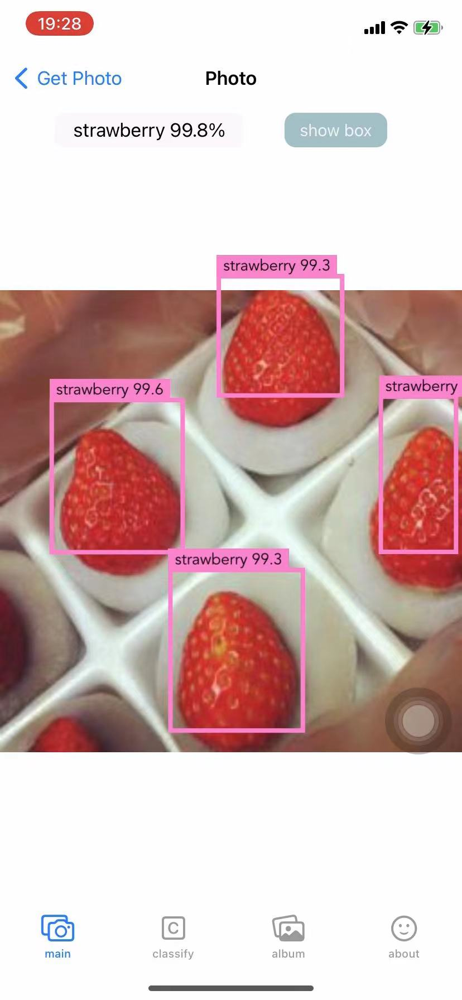
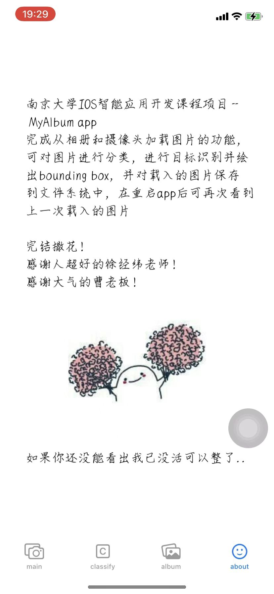

[TOC]

# Final Project

## 实现的功能

在oneMonthHackathon的基础上

- 完成了oneMonthHackathon要求的全部功能
- 完成数据持久化的功能
- 实现对图片内容进行目标检测的功能

## 实现的细节

### 目标检测功能

通过在屏幕提供一个`show box`按钮用于运行目标检测功能

点击后，触发运行`doDetect`函数，大部分代码参考了iw04的代码，即调用模型，并处理模型的结果，将bounding box绘制到屏幕上



### 数据持久化的功能

通过swift提供的`FileManager`模块来完成，主要在`MainView.swift`中实现。

在`ViewDidLoad`函数中，先获取得到存储照片的目录的url，保存在`photoUrl`成员变量中。此时若该目录不存在则进行创建即可，若存在则将目录里面的图片读出并保存到`PhotoView`中的静态成员变量`allImages`和`allLabels`中

```swift
guard let url = manager.urls(for: .documentDirectory, in: .userDomainMask).first else{
    showAlert()
    return
}
photoUrl = url.appendingPathComponent("photos")
let pUrl = photoUrl!
do{
    let fileNames = try manager.contentsOfDirectory(atPath: pUrl.path)
    for f in fileNames{
        let fileUrl = pUrl.appendingPathComponent(f)
        if let imageData = manager.contents(atPath: fileUrl.path){
            if let _image = UIImage(data: imageData){
                PhotoView.allImages.append(_image)
                PhotoView.allLabels.updateValue(ImageLabel(), forKey: _image)
                self.photocnt = self.photocnt + 1
            }
        }
    }
}catch{
    do{
        try manager.createDirectory(at: pUrl, withIntermediateDirectories: false, attributes: [:])
    }catch{
        showAlert()
        return
    }
}
```


在从摄像头或者相册获取新照片时，将获取到的照片写入到该目录中即可

```swift
override func prepare(for segue: UIStoryboardSegue, sender: Any?) {     
    if segue.identifier == "ToPhotoView"{
        let photoView = segue.destination as! PhotoView
        photoView.image = self.photo
        PhotoView.allImages.append(self.photo)
        PhotoView.allLabels.updateValue(ImageLabel(), forKey: self.photo)

        if let pUrl = self.photoUrl{
            let fileUrl = pUrl.appendingPathComponent(String("photo\(self.photocnt).jpeg"))
            if manager.createFile(atPath: fileUrl.path, contents: self.photo.jpegData(compressionQuality: 0.5), attributes: [:]){
                self.photocnt = self.photocnt + 1
            }
        }
    }
}
```

这样子便完成了数据的持久化功能


其他的oneMonthHackathon要求的全部功能已在oneMonthHackathon的报告中编写，在这里便不再赘述。实现的效果已录屏发送在qq群中

## 总结

<p style="color:red">完结撒花🎉，感概一句徐经纬老师真的超级好！曹老板也很大气！</p>

一学期下来还是学了不少ios开发的知识，iw02的作业写完也很有成就感，后面的关于智能的作业写完也很有成就感，而且难度也不是很大，配上模型感觉整个app高大上了不少，iw08也很意思，可以拿来骗小孩子哈哈哈哈哈

可惜的是这学期匆匆结束，家里没有macos环境，在回家前的两天半匆匆在机房肝完了iw08、oneMonthHackathon和这个最后的final project😫，代码也写得可能粗糙了一点，一些想实现的功能迫于时间关系也没有来得及写，本来还想添加上照片删除、拓展图像分类的数据集的功能，但在写完上面这些时只剩一个晚上的时间，匆匆忙忙写了一个彩蛋页面就溜回家了



