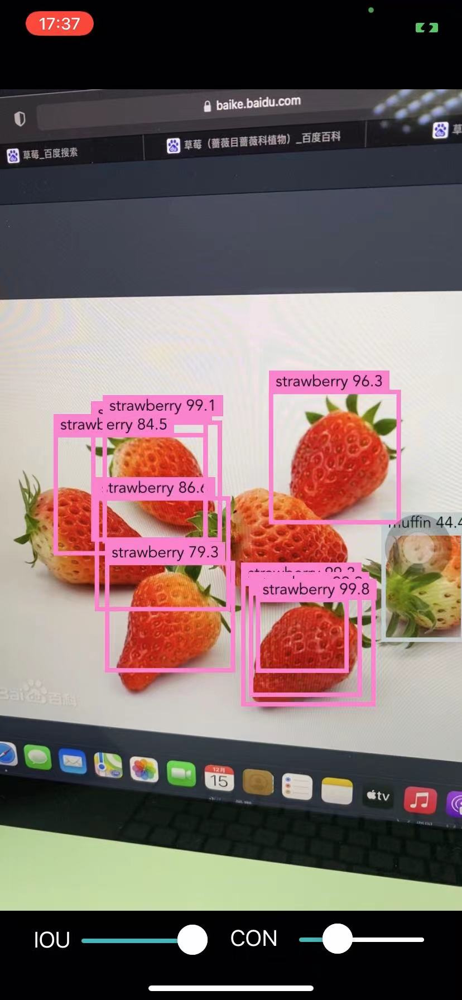
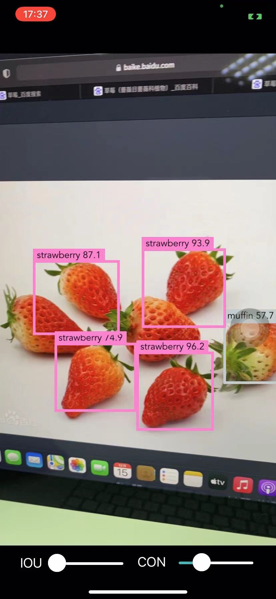
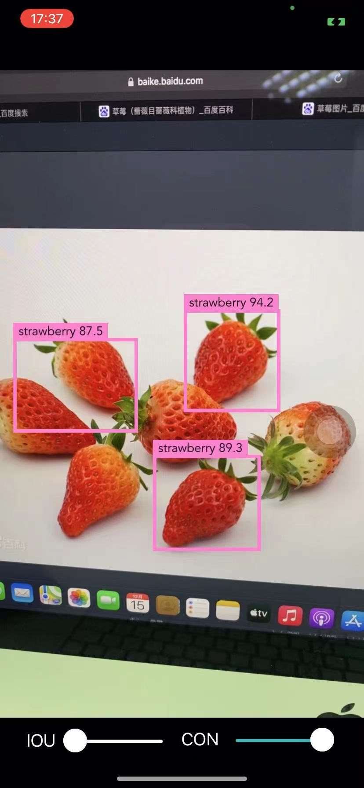

[TOC]

# iw04

## 实现的功能

- 利用Turi Create训练得到的目标检测模型对摄像头捕获到的每一帧图片进行目标识别和绘制bounding box
- 可支持对得到的模型的IOU和Confindence阈值进行调整

## 实现细节

### `func show(predictions: [VNRecognizedObjectObservation])`

参数`predictions`即模型预测得到的结果，对于每一个预测的结果，由于模型中的给出的bounding box的位置是以给出对应坐标相对于图片的长和宽给出的，并且摄像头得到的每一帧图片的尺寸是16：9，而模型的输入图片规格是1：1，在将每一帧图片传给模型时，采用的是`scaleFill`选项，同时由于屏幕采用的坐标系原点和训练数据中的原点位置不同且给出的bounding box位置是相对于图片而我们在设置boundingbox的时候的坐标是相对于整个屏幕，因此在对于模型的结果进行处理时，首先先将bounding box缩放为图片尺寸为16：9的形状，再将其移动到屏幕中合适的位置

```swift
let width = self.view.bounds.width
let height = width * 16 / 9
let diff = (self.view.bounds.height - height) / 2
//first scale the box make it fit in size 16: 9
let scale = CGAffineTransform.identity.scaledBy(x: width, y: height)
//because the origin is different, the we should move
let move = CGAffineTransform(scaleX: 1, y: -1).translatedBy(x: 0, y: -(height + diff))
let rect = predictions[i].boundingBox.applying(scale).applying(move)
```


### `@IBAction func changedValue(_ sender: UISlider)`

将屏幕上的两个滑动条关联到该函数，以检测iou和confidence的阈值的变化

```swift
var changed = false
if sender == self.iouSlider{
    if sender.value != iouThreshold{
        iouThreshold = sender.value
        changed = true
    }
}else{
    if sender.value != confidenceThreshold{
        confidenceThreshold = sender.value
        changed = true
    }
}
```

并在发生变化的时候，调用函数对模型的对应阈值进行修改

```swift
do{
    if changed{
        self.visionModel.featureProvider = try MLDictionaryFeatureProvider(dictionary: [
            "iouThreshold": MLFeatureValue(double: Double(iouThreshold)),
            "confidenceThreshold": MLFeatureValue(double: Double(confidenceThreshold)),
        ])
    }
}catch{
    fatalError("Failed to change IOU or Confidence threshold")
}
```


## 实现的效果

从第一、二张图可以看出，相同confidence下，当IOU阈值变大时，会出现大量重叠的框，这也与预期相符

从第二、三张图可以看出，相同IOU下，当confidence阈值变大时，图中出现的框减少，这也与预期相符




