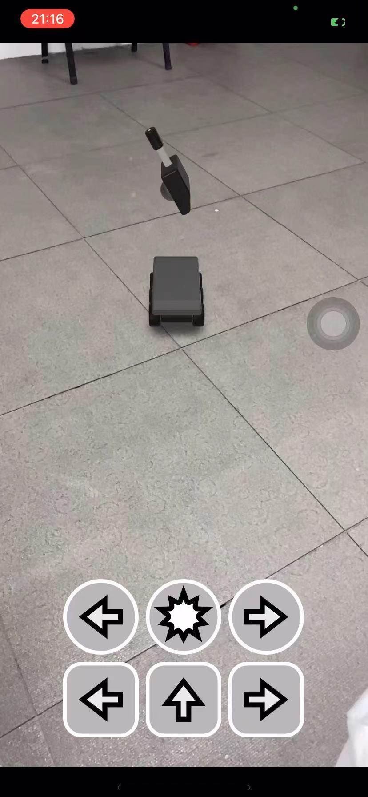

[TOC]

# iw08

## 实现的功能

- 实现了坦克的前进、左转、右转，炮台的左转、右转、开火功能按钮

## 实现细节

本次作业较为简单，ppt上面也有大部分代码，只需要为每个按钮编写对应关联的函数

```swift
@IBAction func turretLeft(_ sender: Any) {
    if self.isActionPlaying{
        return
    }else{
        self.isActionPlaying = true
    }
    tankAnchor!.notifications.turretLeft.post()
}
```

并在`viewDidLoad()`函数中完成相关的初始化操作（将炮台和车身关联）即可

## 实现效果

随手截下来的开火截图，具体视频已上传至qq群

