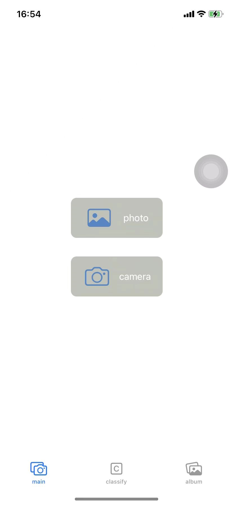
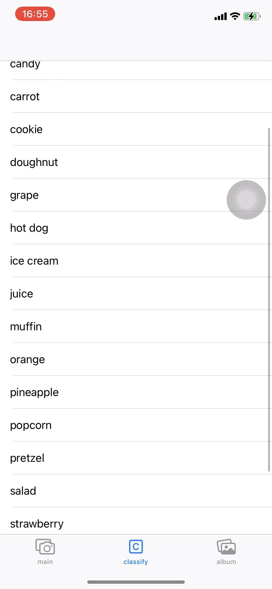
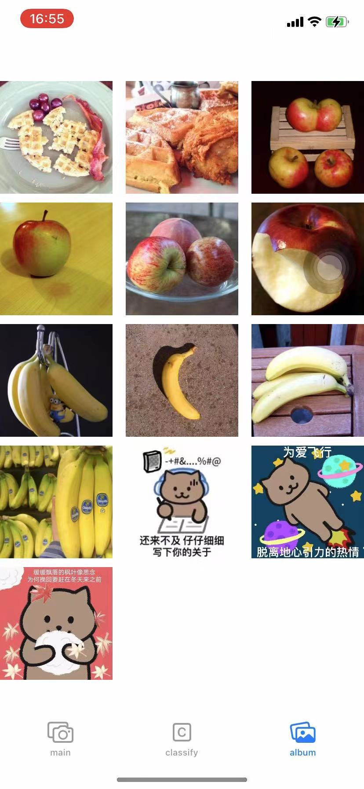

[TOC]

# OneMonthHackathon

## 实现的功能

- 可通过摄像头拍照、从相册加载的方式将图片添加到app中
- 可通过snake模型对照片进行分类
- 采用collection view展示照片，同时也可按照分类结果展示照片，点击照片可单独查看一个照片

## 实现思路

`MainView`、`AlbumView`、`ClassifyView`和`PhotoView`分别是实现以下四个页面的功能



### MainView

通过`UIImagePickerController`来完成从摄像头和相册加载图片的功能，具体参考了iw03的代码

而在获取到图片后，会通过代码触发一次segue，跳转到`PhotoView`页面并将图片传递给它

```swift
func imagePickerController(_ picker:  UIImagePickerController, didFinishPickingMediaWithInfo info: [UIImagePickerController.InfoKey : Any]) {
    picker.dismiss(animated: true)

    self.photo = info[.originalImage] as! UIImage
    self.performSegue(withIdentifier: "ToPhotoView", sender: self)
}

override func prepare(for segue: UIStoryboardSegue, sender: Any?) {
    if segue.identifier == "ToPhotoView"{
        let photoView = segue.destination as! PhotoView
        photoView.image = self.photo
        PhotoView.allImages.append(self.photo)
        PhotoView.allLabels.updateValue(ImageLabel(), forKey: self.photo)
    }
}
```


### PhotoView

PhotoView中有类静态成员`allImages`和`allLabels`用于存放所有已经添加进来的图片以及图片到图片的识别结果（储存在`ImageLabel`类中，保存了识别出来image的类型和confidence信息）的映射关系，类静态成员`classify`用于保存image类型和image之间的映射关系，便于后面按照类别进行查找对应图片

在`ViewDidLoad`函数中，我们首先判断被传递进来的图片是否已经被模型分类过，如果有则直接展示分类结果即可，如果没有则调用模型进行分类

```swift
if let label = PhotoView.allLabels[image!]{
    if label.marked{
        if label.label != "Not Sure"{
            resultLabel.text! = String(format: "%@ %.1f%%", label.label, label.confident * 100)
        }else{
            resultLabel.text! = "Not Sure"
        }
    }
    else{
        classify(image: image!)
    }
}
```

classify函数则大致与iw03中相同，在得到模型识别的结果时，会将对应的结果更新到`allLabels`中，并根据识别出来的图片类型将图片加入到`classify`之中

```swift
let label = PhotoView.allLabels[self.image!]

......

self.resultLabel!.text = String(format: "%@ %.1f%%", results[0].identifier, results[0].confidence * 100)
label?.label = results[0].identifier
label?.confident = Double(results[0].confidence)
if PhotoView.classify[results[0].identifier] != nil {
    PhotoView.classify[results[0].identifier]?.append(self.image!)
}else{
    PhotoView.classify.updateValue([self.image!], forKey: results[0].identifier)
}
```


### AlbumView

首先其有一个成员变量`images`，用于存放所有需要展示的照片：

- 当是查看所有的照片时，该变量会被赋值为所有的照片
- 当是从classify中点击查看某一类的照片时，该变量会被赋值为该一类别的所有照片

```swift
//in file ClassifyView.swift
override func prepare(for segue: UIStoryboardSegue, sender: Any?) {
    if(segue.identifier == "classifyToAlbum"){
        let album = segue.destination as! AlbumView
        let cell = sender as! TableViewCell
        if let _images = PhotoView.classify[cell.label.text!]{
            album.images = _images
        }
    }
}

//in file Navigation.swift
override func viewWillAppear(_ animated: Bool) {
    if let album = self.viewControllers[0] as? AlbumView {
        album.images = PhotoView.allImages
    }
}
```

并且在对应函数中，返回对应值即可

```swift
override func numberOfSections(in collectionView: UICollectionView) -> Int {
    // #warning Incomplete implementation, return the number of sections
    return 1
}


override func collectionView(_ collectionView: UICollectionView, numberOfItemsInSection section: Int) -> Int {
    // #warning Incomplete implementation, return the number of items
    return images.count
}

override func collectionView(_ collectionView: UICollectionView, cellForItemAt indexPath: IndexPath) -> UICollectionViewCell {
    let cell = collectionView.dequeueReusableCell(withReuseIdentifier: "image", for: indexPath) as! CollectionViewCell

    cell.image.image = images[indexPath.item]
    cell.image.contentMode = UIView.ContentMode.scaleAspectFill
    // Configure the cell
    return cell
}
```

随后当点击切换到查看图片页面时，传递对应的图片给PhotoView页面

```swift
override func prepare(for segue: UIStoryboardSegue, sender: Any?) {
    if segue.identifier == "AlbumToImage" {
        let cell = sender as! CollectionViewCell
        let photoView = segue.destination as! PhotoView
        photoView.image = cell.image.image
    }
}
```

最后一个小细节是，我们需要在页面将要出现时，reload一下data，因为有可能在此之前切换到MainView添加了图片

```swift
override func viewDidAppear(_ animated: Bool) {
    self.collectionView.reloadData()
}
```


### ClassifyView

将对应的类别展示之后，只需要处理点击后跳转到显示该类别的图片的逻辑即可

```swift
override func prepare(for segue: UIStoryboardSegue, sender: Any?) {
    if(segue.identifier == "classifyToAlbum"){
        let album = segue.destination as! AlbumView
        let cell = sender as! TableViewCell
        if let _images = PhotoView.classify[cell.label.text!]{
            album.images = _images
        }
    }
}
```

该函数在上面其实已经讲过，就是通过`PhotoView`中的静态成员`classify`找到对应类别的所有图片并传给AlbumView展示即可